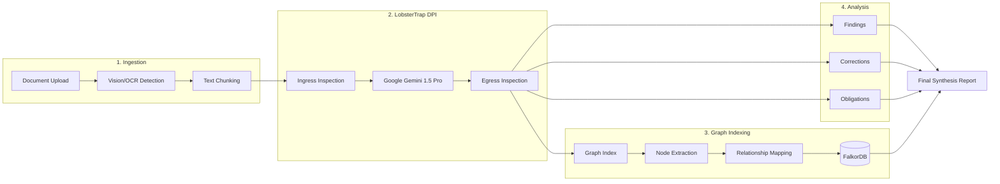

# CATOG Intelligent Enterprise Solution
## High-Performance AI Orchestration with Gemini & LobsterTrap Security

CATOG is an advanced, AI-powered enterprise automation platform built with **Tauri**, **React**, and **TypeScript**. It is designed to act as an intelligent enterprise knowledge assistant, merging world-class reasoning with industrial-grade security.
---

## 🧠 Core Intelligence: Google Gemini Engine

CATOG leverages **Google Gemini** (1.5 Pro and Flash) as its primary neural engine for complex reasoning, specialist review, and final synthesis.

### Gemini Functions & Integration:
*   **Specialist Specialists**: Specialized agents (Legal, Finance, Tech) utilize Gemini's massive context window to process hundreds of pages of documentation simultaneously.
*   **Multi-Step Reasoning**: Gemini powers the sequential and parallel multi-agent analysis flows, identifying gaps (Findings), suggesting modifications (Corrections), and tracking responsibilities (Obligations).
*   **Dynamic RAG**: Integrates Gemini embeddings for semantic search across the internal Knowledge Base, ensuring agent responses are grounded in enterprise facts.
*   **Vision-Language Analysis**: Gemini Pro Vision is used for layout detection and visual document parsing, understanding tables, charts, and handwritten signatures.

---

## 🛡️ Security Layer: LobsterTrap Audit Suite

Every communication between CATOG and the AI models is intercepted and inspected by **LobsterTrap**, a local-first security middleware designed for enterprise compliance.

### How LobsterTrap Works:
LobsterTrap operates as a **Deep Prompt Inspection (DPI)** proxy. It ensures that the AI remains helpful while preventing security regressions.

1.  **Ingress Inspection (Request)**:
    *   **Intent Declaration**: CATOG declares the intent of every request (e.g., "enterprise_automation").
    *   **Data Leak Prevention (DLP)**: LobsterTrap scans prompts for sensitive PII, PHI, or internal trade secrets before they leave the secure environment.
    *   **Injection Guard**: Detects and blocks prompt injection patterns that might attempt to hijack the agent's logic.

2.  **Egress Inspection (Response)**:
    *   **Hallucination Detection**: Compares the AI output against the original document context and Knowledge Base evidence to identify factual mismatches.
    *   **Compliance Verdict**: Assigns a security verdict (`ALLOW`, `WARN`, or `DENY`) to every response.
    *   **Chain of Custody**: Generates a cryptographically signed hash for every interaction, ensuring the audit trail is tamper-proof.

---

## 🔄 Technical Logic & Workflow: Gemini + LobsterTrap + Graph Indexing

### Observability Flow:
*   **Execution Logs**: Every agent task in the "Sequential Flow" includes a LobsterTrap status badge. Users can click the **Audit Report** link to view the raw security metrics and risk scores.
*   **Neural Graph Branch**: The diagram above illustrates the parallel execution of the **Graph Indexing** branch, where entities are extracted into nodes and relationships are mapped in real-time.
*   **System Interface (Terminal)**: Real-time security events are logged to the system terminal, providing a constant visibility of "Security Protocol v2.4" in action.
*   **Analysis Graph**: The interactive Knowledge Graph header displays the current LobsterTrap monitoring status, ensuring all visualized entities are verified.

---

## 🛠️ Technology Stack
*   **Frontend**: React, TypeScript, Vite, Tailwind CSS (Neon-Cyan/Matrix Aesthetic)
*   **Desktop Runtime**: Tauri (Rust-based)
*   **Primary AI**: Google Gemini 1.5 Pro/Flash
*   **Security Middleware**: LobsterTrap (Golang-based DPI Proxy)
*   **Graph Engine**: FalkorDB (Live Intelligence Graph)
*   **Vector Engine**: Qdrant / Local llama.cpp
*   **Vision**: ONNX Document Layout Detection (YOLOv11)

---

## 🎖️ Credits & Open Source Acknowledgments

CATOG is built upon a foundation of world-class open-source research and engineering. We gratefully acknowledge the following projects and their contributors:

### Security & Inference:
*   **[LobsterTrap](https://github.com/coal/lobstertrap)**: Deep Prompt Inspection (DPI) proxy and security middleware.
*   **[llama.cpp](https://github.com/ggerganov/llama.cpp)**: High-performance LLM inference engine for local embeddings and processing.
*   **[Nomic Embed Text](https://huggingface.co/nomic-ai/nomic-embed-text-v1.5)**: Open-source, high-dimensional text embeddings.

### Core Frameworks & Runtime:
*   **[Tauri Framework](https://github.com/tauri-apps/tauri)**: Secure, cross-platform desktop application runtime.
*   **[React](https://github.com/facebook/react)** & **[TypeScript](https://github.com/microsoft/TypeScript)**: Frontend UI and type-safe development.
*   **[Vite](https://github.com/vitejs/vite)**: Next-generation frontend tooling.

### Data & Vision Engines:
*   **[FalkorDB](https://github.com/FalkorDB/FalkorDB)**: Low-latency Knowledge Graph engine.
*   **[Qdrant](https://github.com/qdrant/qdrant)**: Distributed vector database for semantic search.
*   **[ONNX Runtime](https://github.com/microsoft/onnxruntime)**: Cross-platform machine learning model accelerator.
*   **[YOLOv11 Document Layout](https://huggingface.co/Armaggheddon/yolo11-document-layout)**: Pretrained YOLOv11 model by Armaggheddon for advanced document layout detection.
*   **[Ultralytics YOLO](https://github.com/ultralytics/ultralytics)**: The underlying real-time object detection framework.
*   **[Tesseract OCR](https://github.com/tesseract-ocr/tesseract)**: The world's most popular open-source OCR engine (v5), used for text extraction.
*   **[OpenCV.js](https://github.com/opencv/opencv)**: Open-source computer vision library.

### Intelligence Partners:
*   **[Google Gemini](https://github.com/google/generative-ai-js)**: Primary reasoning engine and Vision-Language models.

---

## 🚀 Getting Started
1.  **Configure API Keys**: Add your Gemini API Key in the Configuration Modal.
2.  **Verify LobsterTrap**: Ensure the local LobsterTrap proxy is running (default: `http://127.0.0.1:8080`).
3.  **Ingest Data**: Upload your PDF/DOCX files to the Knowledge Base.
4.  **Run Analysis**: Select a document and trigger the Multi-Agent Review.

*Built for privacy, intelligence, and industrial-grade security. CATOG ensures you never miss critical information in your documents again.*